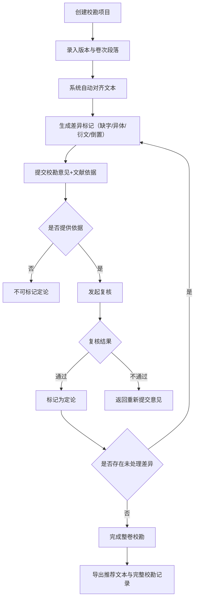

## 1. 产品概述

古籍校勘比对系统是一款面向学术研究人员的在线协作工具，帮助研究者对同一古籍的不同版本进行逐段比对、记录差异并共同确定推荐文本。系统通过自动化文本对齐、结构化校勘记录和协作复核机制，提升古籍整理工作的效率和准确性。

## 2. 核心功能

### 2.1 功能模块

1. **项目管理**：创建校勘项目，管理项目基本信息与参与人员
2. **版本录入**：录入不同版本的卷次、段落编号与原始文本
3. **文本对齐与差异标记**：系统自动对齐不同版本的文本，标记缺字、异体字、衍文、倒置等差异
4. **校勘意见**：为差异提交校勘意见、引用文献依据，标记定论状态
5. **复核机制**：原始版本修改后，相关校勘结论自动变为待复核
6. **进度可视化**：展示版本对照视图、待处理差异数量、校勘进度统计
7. **数据导出**：导出推荐文本，保留完整校勘记录

### 2.2 页面详情

| 页面名称 | 模块名称 | 功能描述 |
|-----------|-------------|---------------------|
| 首页/项目列表 | 项目卡片列表 | 展示所有校勘项目，显示基本信息与进度概览 |
| 首页/项目列表 | 新建项目表单 | 弹窗形式创建新校勘项目 |
| 项目详情页 | 版本管理 | 管理项目下的不同版本，添加/编辑版本信息 |
| 项目详情页 | 卷次段落管理 | 按卷次录入段落文本，确保编号连续 |
| 文本对照页 | 多版本并排视图 | 多列并排展示不同版本对应段落，高亮差异 |
| 文本对照页 | 差异标记面板 | 分类展示缺字、异体字、衍文、倒置差异 |
| 校勘意见页 | 差异详情卡片 | 展示具体差异内容与所有校勘意见 |
| 校勘意见页 | 意见提交表单 | 提交校勘意见、文献依据，发起复核 |
| 校勘意见页 | 定论标记 | 为有充分依据的意见标记为定论 |
| 进度仪表盘 | 统计卡片 | 待处理差异数、已定论数、各卷校勘进度 |
| 导出页面 | 导出配置 | 选择导出范围与格式，生成含校勘记录的文档 |

## 3. 核心流程

### 3.1 主工作流

研究人员创建校勘项目 → 录入多个版本的卷次与段落 → 系统自动对齐并标记差异 → 针对差异提交校勘意见和文献依据 → 其他研究人员复核 → 标记定论 → 完成整卷校勘 → 导出推荐文本与校勘记录

### 3.2 流程图

## 4. 用户界面设计

### 4.1 设计风格

- **主色调**：古籍墨色 (#2c3e50) 搭配宣纸米白 (#f5f0e8)，点缀朱砂红 (#c0392b) 表示重要标记
- **辅助色**：差异类型四色区分：缺字(#e74c3c)、异体字(#f39c12)、衍文(#8e44ad)、倒置(#2980b9)
- **字体**：正文使用思源宋体（展示古籍质感），UI 界面使用思源黑体
- **布局风格**：卡片式布局，顶部导航 + 侧边栏，版本对照采用并排表格布局
- **按钮风格**：圆角矩形，古典印章质感的主要操作按钮

### 4.2 页面设计概览

| 页面名称 | 模块名称 | UI 元素 |
|-----------|-------------|-------------|
| 项目列表页 | 项目卡片 | 米色卡片底、墨色标题、朱砂进度条、状态徽标 |
| 文本对照页 | 差异高亮 | 不同颜色下划线/背景色标记差异、悬浮提示差异类型 |
| 校勘意见页 | 意见卡片 | 时间线布局展示意见历史、文献引用上标标注 |
| 进度仪表盘 | 统计图表 | 环形进度图、差异类型分布饼图、卷次进度条 |

### 4.3 响应式设计

桌面端优先，移动端适配。版本对照视图在移动端切换为纵向堆叠布局，支持左右滑动切换版本。

## 5. 业务规则约束

1. **版本名称唯一性**：同一项目下版本名称不能重复
2. **段落编号连续性**：同一卷内段落编号必须连续，不得跳过或重复
3. **修改触发复核**：原始版本文本修改后，相关校勘结论自动变为待复核状态
4. **依据约束定论**：未提供文献依据的校勘意见不能标记为定论
5. **完整性约束**：存在未处理差异时不能完成整卷校勘
6. **导出完整性**：导出文本必须保留完整校勘记录（所有差异、意见、依据、定论结果）
