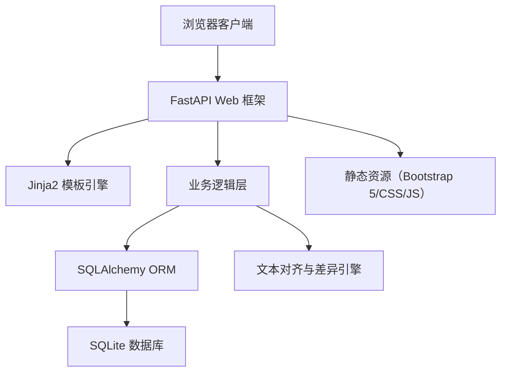
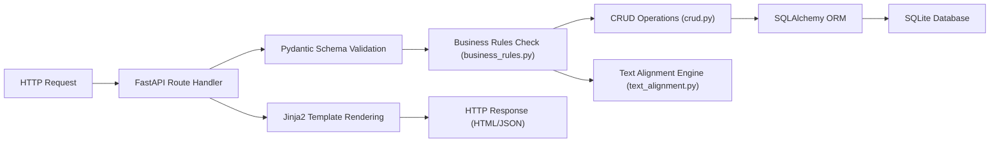
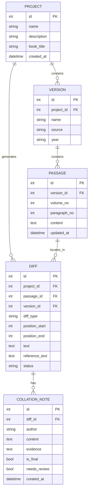

## 1. 架构设计



## 2. 技术栈说明

- **Web 框架**：FastAPI 0.100+
- **模板引擎**：Jinja2
- **前端 UI**：Bootstrap 5.3
- **数据库**：SQLite 3（通过 SQLAlchemy 2.0 ORM 访问）
- **Python 版本**：3.10+
- **文本差异算法**：基于 difflib 的自定义对齐算法

## 3. 目录结构

```
nyh-52/
├── app/
│   ├── __init__.py
│   ├── main.py              # FastAPI 应用入口
│   ├── database.py          # 数据库连接与会话
│   ├── models.py            # SQLAlchemy ORM 模型
│   ├── schemas.py           # Pydantic 数据校验模型
│   ├── crud.py              # 数据库 CRUD 操作
│   ├── text_alignment.py    # 文本对齐与差异检测引擎
│   ├── business_rules.py    # 业务规则校验
│   ├── export.py            # 导出功能
│   ├── routers/
│   │   ├── __init__.py
│   │   ├── projects.py      # 项目相关路由
│   │   ├── versions.py      # 版本相关路由
│   │   ├── passages.py      # 段落相关路由
│   │   ├── collation.py     # 校勘意见路由
│   │   └── export.py        # 导出路由
│   └── templates/
│       ├── base.html        # 基础布局模板
│       ├── index.html       # 项目列表首页
│       ├── project_detail.html  # 项目详情
│       ├── version_compare.html # 版本对照
│       ├── collation_view.html  # 校勘视图
│       └── dashboard.html   # 进度仪表盘
├── static/
│   ├── css/
│   │   └── custom.css       # 自定义样式
│   └── js/
│       └── main.js          # 前端交互逻辑
├── data/
│   └── collation.db         # SQLite 数据库文件
├── requirements.txt         # Python 依赖
└── README.md
```

## 4. 路由定义

| 路由方法 | 路径 | 用途 |
|---------|------|------|
| GET | / | 项目列表首页 |
| GET, POST | /projects/create | 创建新项目 |
| GET | /projects/{id} | 项目详情页 |
| GET, POST | /projects/{id}/versions | 管理项目版本 |
| GET, POST | /projects/{id}/passages | 录入段落文本 |
| GET | /projects/{id}/compare | 版本对照视图 |
| GET, POST | /projects/{id}/collation/{diff_id} | 校勘意见管理 |
| GET | /projects/{id}/dashboard | 进度仪表盘 |
| GET | /projects/{id}/export | 导出校勘结果 |

## 5. API 数据模型

### 5.1 项目 Project

```python
class ProjectBase:
    name: str           # 项目名称
    description: str    # 项目描述
    book_title: str     # 古籍书名
```

### 5.2 版本 Version

```python
class VersionBase:
    project_id: int
    name: str           # 版本名称（项目内唯一）
    source: str         # 版本来源/版本说明
    year: str           # 版本年代
```

### 5.3 卷次与段落 Passage

```python
class PassageBase:
    version_id: int
    volume_no: int      # 卷次编号
    paragraph_no: int   # 段落编号（卷内连续）
    content: str        # 段落文本内容
```

### 5.4 差异标记 Diff

```python
class DiffBase:
    project_id: int
    passage_id: int
    diff_type: str      # missing(缺字)/variant(异体)/added(衍文)/reversed(倒置)
    position_start: int
    position_end: int
    version_id: int     # 差异所在版本
    text: str           # 差异文本
    reference_text: str # 对照版本文本
    status: str         # pending/reviewed/finalized
```

### 5.5 校勘意见 CollationNote

```python
class CollationNoteBase:
    diff_id: int
    author: str
    content: str        # 校勘意见内容
    evidence: str       # 文献依据
    is_final: bool      # 是否为定论
    needs_review: bool  # 是否待复核
```

## 6. 服务器架构



## 7. 数据模型

### 7.1 ER 图



### 7.2 DDL 语句

```sql
CREATE TABLE project (
    id INTEGER PRIMARY KEY AUTOINCREMENT,
    name VARCHAR(255) NOT NULL,
    description TEXT,
    book_title VARCHAR(255) NOT NULL,
    created_at DATETIME DEFAULT CURRENT_TIMESTAMP
);

CREATE TABLE version (
    id INTEGER PRIMARY KEY AUTOINCREMENT,
    project_id INTEGER NOT NULL,
    name VARCHAR(255) NOT NULL,
    source TEXT,
    year VARCHAR(50),
    UNIQUE(project_id, name),
    FOREIGN KEY (project_id) REFERENCES project(id) ON DELETE CASCADE
);

CREATE TABLE passage (
    id INTEGER PRIMARY KEY AUTOINCREMENT,
    version_id INTEGER NOT NULL,
    volume_no INTEGER NOT NULL,
    paragraph_no INTEGER NOT NULL,
    content TEXT NOT NULL,
    updated_at DATETIME DEFAULT CURRENT_TIMESTAMP,
    UNIQUE(version_id, volume_no, paragraph_no),
    FOREIGN KEY (version_id) REFERENCES version(id) ON DELETE CASCADE
);

CREATE TABLE diff (
    id INTEGER PRIMARY KEY AUTOINCREMENT,
    project_id INTEGER NOT NULL,
    passage_id INTEGER NOT NULL,
    version_id INTEGER NOT NULL,
    diff_type VARCHAR(20) NOT NULL,
    position_start INTEGER NOT NULL,
    position_end INTEGER NOT NULL,
    text TEXT,
    reference_text TEXT,
    status VARCHAR(20) DEFAULT 'pending',
    FOREIGN KEY (project_id) REFERENCES project(id) ON DELETE CASCADE,
    FOREIGN KEY (passage_id) REFERENCES passage(id) ON DELETE CASCADE,
    FOREIGN KEY (version_id) REFERENCES version(id) ON DELETE CASCADE
);

CREATE TABLE collation_note (
    id INTEGER PRIMARY KEY AUTOINCREMENT,
    diff_id INTEGER NOT NULL,
    author VARCHAR(255) NOT NULL,
    content TEXT NOT NULL,
    evidence TEXT,
    is_final BOOLEAN DEFAULT 0,
    needs_review BOOLEAN DEFAULT 0,
    created_at DATETIME DEFAULT CURRENT_TIMESTAMP,
    FOREIGN KEY (diff_id) REFERENCES diff(id) ON DELETE CASCADE
);
```
